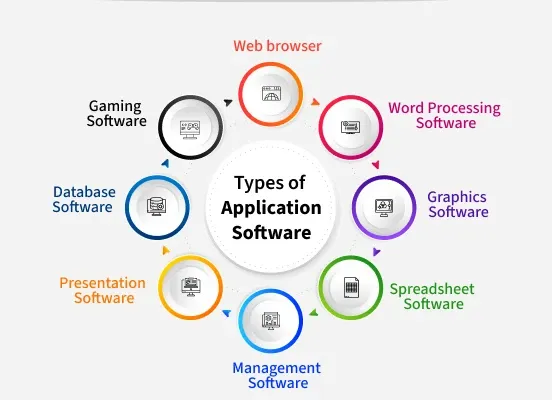

# what is Applicationsoftwear 

Application software (or "apps") are computer programs designed for end-users to perform specific tasks, ranging from word processing and web browsing to editing photos or managing finances. Unlike system software that runs the device, application software focuses on user productivity, creativity, and daily tasks

Examples of Application Software:

1. Web Browsers: Google Chrome, Mozilla Firefox, Safari.

2. Word Processors & Productivity: Microsoft Word, Google Docs, Excel.

3. Media Players/Multimedia: VLC Media Player, Spotify, YouTube.

4. Graphic Design & Editing: Adobe Photoshop, Canva.

5. Mobile Apps: WhatsApp, Instagram, TikTok.

6. Enterprise Software: Salesforce (CRM), QuickBooks (Accounting)

