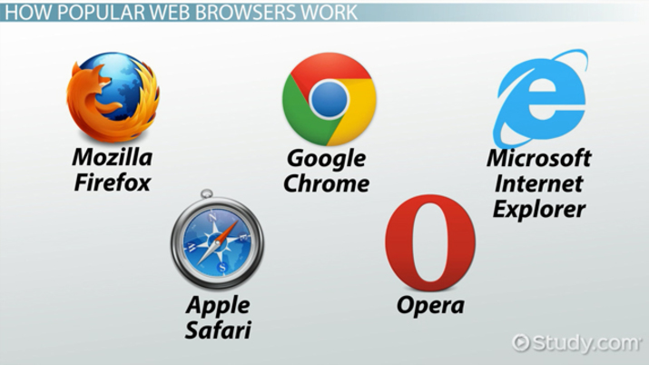

# what_is_Browser

A web browser is a software application used to access, navigate, and display information on the World Wide Web, including websites, images, and videos. It retrieves data from web servers and translates code (HTML, CSS) into a user-friendly format. Common examples include Google Chrome, Safari, and Firefox.

Browser Examples
1. Google Chrome: Most used browser, known for speed and wide extension support.
Safari: Default, high-performance browser for Apple devices.

2. Mozilla Firefox: Open-source and focused on privacy.

3. Microsoft Edge: Default for Windows, optimized for Microsoft services.
Opera: Known for its built-in VPN and ad-blocker features.

4. Brave: Focused on ad-free and privacy-oriented browsing

