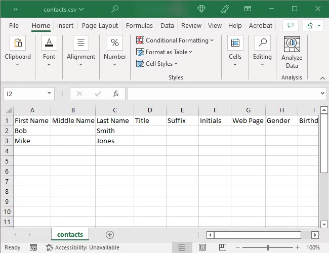

# what_is_CSV

A CSV (Comma-Separated Values) file is a plain text file, often with an.csv extension, that stores tabular data (rows and columns) in a plain text format. 

Usage Examples

1. Data Transfer: Moving data between different programs (eg, exporting contacts from Gmail to Excel).

2. Database Management: Importing/exporting large datasets to a database.

3. Data Analysis: Using in tools like Python or Excel for analysis.

4. Contact/Inventory Lists: Storing lists of names, addresses, or items.

