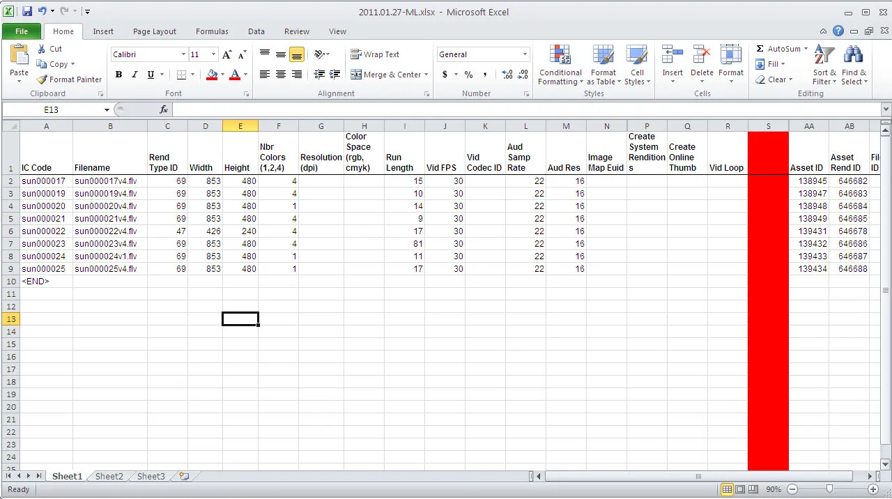

# what_is_Excel

Microsoft Excel is a powerful spreadsheet application developed by Microsoft, widely used for storing, organizing, calculating, and analyzing data using a grid of rows and columns. Part of the Microsoft Office suite, it enables users to perform complex calculations, create charts/visualizations, and manage large datasets efficiently

Examples :

1. Accounting & Bookkeeping: Tracking expenses, income, and budgets.

2. Financial Analysis: Building projections and models.

3. Data Management: Managing large, structured datasets. [1, 2, 3]

4. Excel is widely used across all business functions, from small businesses to large corporations

