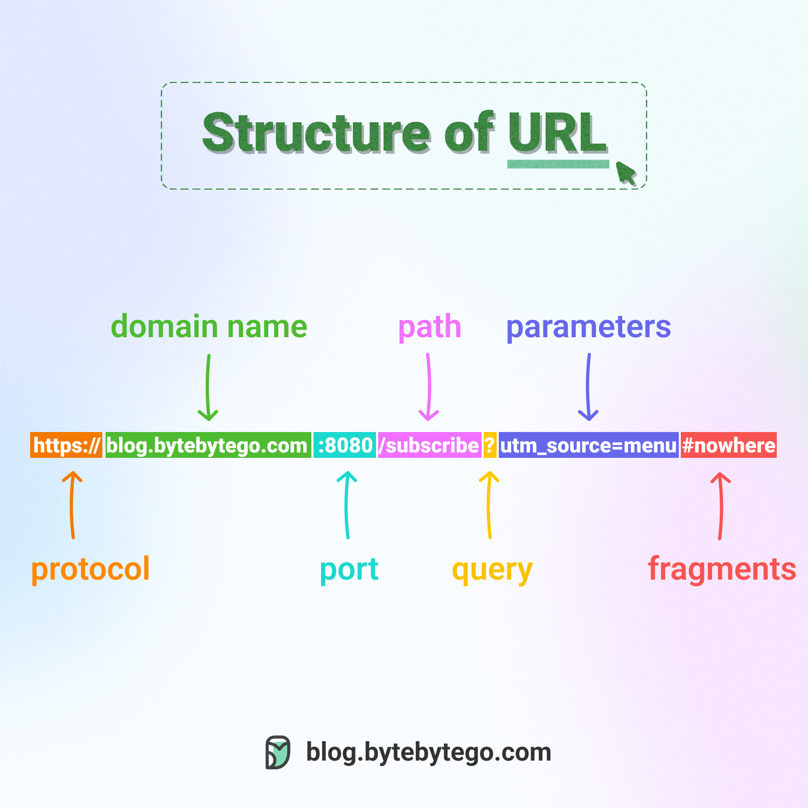

# what_is_URL

A URL (Uniform Resource Locator) is the unique address used to locate specific resources—such as webpages, images, or documents—on the internet. Functioning as a "web address," it tells browsers how and where to find content, typically consisting of a protocol (e.g., https), domain name (e.g., google.com), and file path

Examples of URLs:

1. Browsing: Entering https://www.wikipedia.org into a browser to visit a website.

2. Linking: Clicking a hyperlinked text (<a> tag) in an HTML document to navigate to another page.

3. Media Display: Using a URL to display images (), videos, or styled content (CSS) on a webpage.

4. File Access: ftp://files.example.com/document.pdf to download a document. [1, 2, 3, 4, 5]

