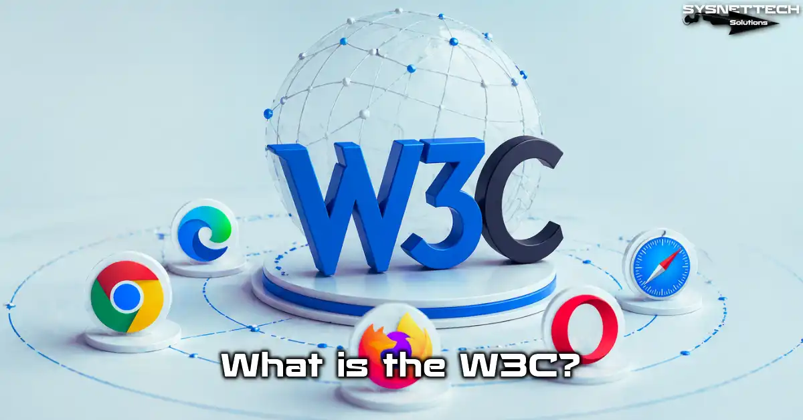

# WHAT IS W3C

The World Wide Web Consortium (W3C) is the primary international, non-profit organization that develops open, royalty-free standards to ensure the long-term growth, accessibility, and interoperability of the web. Founded in 1994 by WWW inventor Tim Berners-Lee, it sets crucial technical specifications like HTML, CSS, and accessibility guidelines (WCAG).

** Example **

1. Standards Development: The W3C develops protocols and guidelines (e.g., HTML, CSS, XML) used to create over two billion websites.

2. Web Accessibility Guidelines (WCAG): The W3C creates universal standards for web accessibility, ensuring web content is accessible to all users.
Markup Validation Service: A free service provided by W3C to check the validity of web documents, such as HTML or XHTML, helping to improve website quality and performance.

3. W3C WebDriver Protocol: A standard that enables consistent, automated testing of web applications across different browsers.
Open Standards Promotion: The W3C ensures that the web is a "Web for All" and "Web on Everything," working across various devices and platforms

