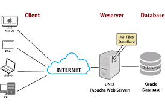

# what_is_webserver

A web server is a system that stores, processes, and delivers web content—like HTML pages, images, and videos—to users over the internet

(Example)

Imagine you want to visit ://google.com:

1. Request: You type the URL into your browser. Your browser sends an HTTP request to the web server hosting that site.

2. Processing: The MDN Web Docs explains that the software on the server (the HTTP server) receives this request, finds the correct file, and prepares it.

3. Response: The server sends the website files back to your browser, which then displays the page on your screen.

